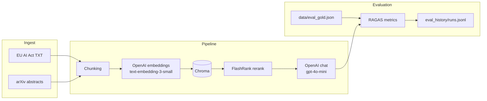

# Production RAG System with Evaluation Dashboard

Retrieval stack over a **public corpus** (EU AI Act consolidated text from [EUR-Lex](https://eur-lex.europa.eu/legal-content/EN/TXT/?uri=CELEX%3A32024R1689) and **arXiv** abstracts), with **automated [RAGAS](https://docs.ragas.io/)** metrics recorded over time for a simple evaluation dashboard in **Gradio**.

## Architecture



**Why Chroma (not Qdrant here):** embedded, file-backed vector search fits local dev and Hugging Face Spaces without running a separate vector service. You can swap `src/vector_store.py` for Qdrant’s client if you already operate a cluster.

## Quick start

```bash
python -m venv .venv
.venv\Scripts\activate   # Windows
# source .venv/bin/activate  # macOS/Linux
pip install -r requirements.txt
copy .env.example .env     # add OPENAI_API_KEY
python scripts/build_index.py
python app.py
```

Optional CLI evaluation:

```bash
python scripts/run_eval.py
```

## Hugging Face Spaces

1. Create a **Gradio** Space and push this repository (or connect GitHub).
2. Add a **Repository secret**: `OPENAI_API_KEY`.
3. Run `python scripts/build_index.py` once (e.g. local machine) and commit `data/chroma/` **or** run the build step in a Space **builder** job / one-off shell if your tier allows—embeddings require the key and network.
4. For ephemeral disks, expect the index to disappear on restart unless you persist `data/chroma/` (e.g. attach storage or rebuild on boot with `AUTO_BUILD_INDEX=1`—see `app.py` / env notes below).

## RAGAS metrics

Each evaluation run computes row-level scores then means:

| Metric | What it reflects |
|--------|------------------|
| **faithfulness** | Answer grounded in retrieved contexts |
| **answer_relevancy** | Answer addresses the question |
| **context_precision** | Retrieved context precision vs. reference |

Means are appended to `eval_history/runs.jsonl` with an ISO timestamp so the Gradio **Evaluation** tab can plot trends.

## Benchmark scores (example)

Scores depend on corpus freshness, chunking, models, and judge variance. After your first local `python scripts/run_eval.py`, fill in your own row:

| Run date (UTC) | faithfulness | answer_relevancy | context_precision |
|----------------|-------------|------------------|---------------------|
| *template* | *run eval* | *run eval* | *run eval* |

## Environment variables

| Variable | Purpose |
|----------|---------|
| `OPENAI_API_KEY` | Embeddings, chat, RAGAS judges |
| `OPENAI_CHAT_MODEL` | Default `gpt-4o-mini` |
| `OPENAI_EMBED_MODEL` | Default `text-embedding-3-small` |
| `RAG_CHUNK_SIZE` / `RAG_CHUNK_OVERLAP` | Chunking |
| `RAG_RETRIEVE_K` / `RAG_RERANK_TOP_N` | Retrieval / rerank depth |
| `AUTO_BUILD_INDEX` | Set to `1` / `true` to build Chroma on startup if the index is empty (Spaces cold start) |

## What I learned

- **RAG quality is a systems problem:** small changes in chunk size, `k`, or rerank depth often matter as much as the generator model.
- **RAGAS is invaluable for regression tracking** but noisy row-by-row; means over a fixed gold set plus **time series** in the UI make improvements visible.
- **EUR-Lex HTML is noisy** for scraping; caching raw text under `data/raw/` keeps iteration cheap.
- **Abstract-only arXiv** keeps the demo lightweight; full-PDF ingestion would need OCR/parsing and heavier infra.
- **Spaces + OpenAI** is simple operationally, but **cost and rate limits** belong in the design (batch embed once, cache Chroma, cap eval frequency).

## License

MIT
